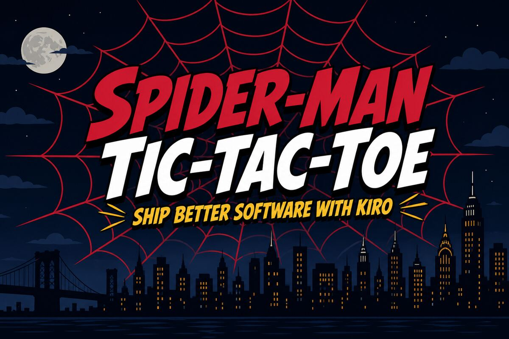

# Spider-Man Tic-Tac-Toe



Spider-Man themed Tic-Tac-Toe built for the **Ship Better Software with Kiro** workshop (AWS Builder Group – Makerere University). Spec-driven development with Vue 3, TypeScript, and Tailwind CSS.

**Play live:** [kiro-tic-tac-toe-workshop.vercel.app](https://kiro-tic-tac-toe-workshop.vercel.app/)

**Session slides:** [Canva presentation](https://canva.link/dtlm0ydr9ak1afg)

---

## Features

- **Custom boards** — grid sizes from 3×3 to 10×10
- **Hot-seat 2-player** — both players on the same device
- **vs CPU** — Easy / Medium / Hard (random, blocking, minimax)
- **Custom symbols** — pick distinct marks for each player
- **Win / draw detection** with result overlay and replay
- **Persistence** — autosave in-progress games; history in `localStorage`
- **Leaderboard & player stats** from completed sessions
- **Game history + move-by-move replay**
- **Spider-Man UI** — crimson / navy / gold theme, landing backdrop, favicons

---

## Tech Stack

| Layer | Choice |
| --- | --- |
| UI | Vue 3 (Composition API) + Vue Router |
| Language | TypeScript |
| Styling | Tailwind CSS + custom theme tokens |
| State | Composables (+ Pinia available) |
| Storage | `localStorage` via storage adapter |
| Build | Vite |
| Tests | Vitest + Vue Test Utils |
| Deploy | Vercel (`vercel.json` SPA rewrites) |

---

## Getting Started

**Requirements:** Node.js 18+ and npm.

```bash
git clone https://github.com/awsclubmuk/kiro-tic-tac-toe-workshop.git
cd kiro-tic-tac-toe-workshop
npm install
npm run dev
```

App runs at `http://localhost:5173`.

---

## Scripts

| Command | Description |
| --- | --- |
| `npm run dev` | Vite dev server with HMR |
| `npm run build` | Production build → `dist/` |
| `npm run preview` | Preview the production build |
| `npm run test:run` | Run unit / integration tests once |
| `npm test` | Vitest in watch mode |
| `npm run lint` | ESLint on `src` |

---

## Project Structure

```
src/
  components/   # UI (board, menu, overlays, panels)
  composables/  # Game flow, CPU, config, leaderboard
  views/        # Routed screens (home, setup, game, history, leaderboard)
  utils/        # Board logic, AI strategies, storage, metrics
  styles/       # Global CSS + animations
  types/        # Shared TypeScript types
public/         # Favicons and static assets
docs/           # README assets
.kiro/specs/    # Specs, design, and task plan
```

---

## How to Play

1. **New Game** → choose mode (2-player or vs CPU), board size, symbols.
2. **2-player** — pass the device; the turn banner shows whose move it is.
3. **vs CPU** — you play, then the AI responds after a short think delay.
4. After a win or draw, **Replay** or return to the **Main Menu**.
5. Check **Leaderboard** and **History** from the home screen.

---

## Deploy on Vercel

**Live app:** [https://kiro-tic-tac-toe-workshop.vercel.app/](https://kiro-tic-tac-toe-workshop.vercel.app/)

The repo includes `vercel.json` (Vite build, `dist` output, SPA rewrites).

```bash
npx vercel
```

Or connect the GitHub repo in the [Vercel dashboard](https://vercel.com) — framework preset **Vite** is detected automatically.

---

## Workshop Context

This project started from the Kiro workshop track:

- Spec-driven development (`.kiro/specs/tic-tac-toe-game/`)
- Steering AI with project rules
- GitHub workflow and AI-assisted engineering practices

**Slides used in the session:** [https://canva.link/dtlm0ydr9ak1afg](https://canva.link/dtlm0ydr9ak1afg)

---

## License

See [LICENSE](LICENSE).
